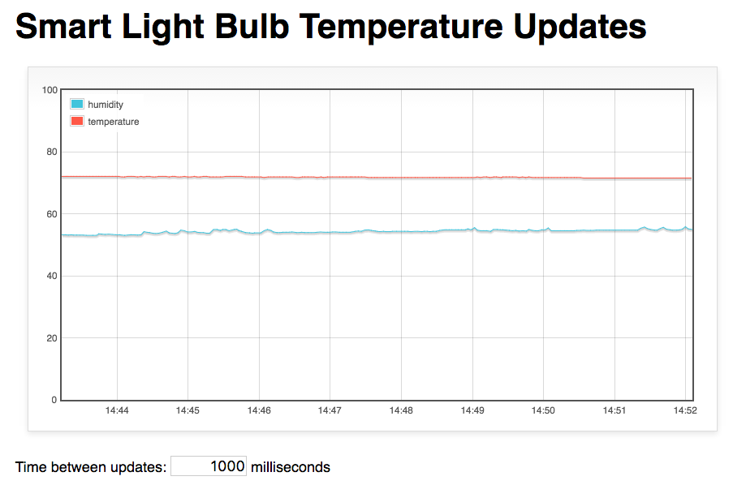

# Summary
This example shows how to create a Murano Solution Application that consists of a single web page that graphs sensor data for a specific device.

### Shows:
* Interacting with Solution API Routes from Web Page
* Deploying a simple (html,css,javascript) single page web app
* Time Series data - Setting up Murano Services for routing product data into time series database and querying out for the graph

### Does Not Include
* Users / Auth - this is a simple public web page
* Device / Product code - Assumes data is being generated by a device in a Murano Product instance.  

### Assumptions
A device is sending data with resources `temperature` and `humidity` to your Product instance.

### To use:

1. Create a Solution - using this template < LINK TO SOLUTION FILE HERE > to populate the solution API Routes, Assets, and Service Set-up.
2.
3.

#### Notes:
2. WARNING: This is reference code, there are no guarantees.  It's easy to change the code and have it break.  Tip: Use source control when editing!
3. WARNING: Using code that refreshes often in browser windows carefully.  You can easily kill your browser.

### Examples of what it looks like

